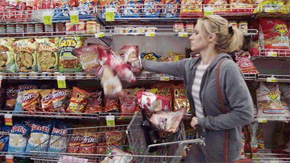

---
title: "Predicting Customer Behavior Towards a Marketing Campaign"
author: "Stella Jia"
output:
  pdf_document:
    toc: yes
  html_document:
    theme: spacelab
    toc: yes
    toc_float: yes
    code_folding: show
    df_print: paged
---

```{r setup, include=FALSE}
knitr::opts_chunk$set(echo = TRUE, message = FALSE,
                      warning = FALSE)
```

## 1. Introduction

### 1.1 Motive

A few years ago, I read my first nonfiction self-help book: "The Power of Habit." I was hooked on how the book provided a frame to manage the randomness of our lives through something as simple as habits. Since then, I haven't stopped reading self-help books.

<center>
{width=400px} 
</center>

Beyond the self, there was a section in the book that shifted my paradigm on the interaction between businesses and customers. The book highlighted the strategy Target uses to push ads towards their customers. Based on objective features like their gender, age, home address, past purchases, etc, they could identify the **habits** of their customers and predict when a customer was pregnant months before the customer would even know. 

As creepy as that sounds, it's actually incredibly interesting how an objective factor like data could reveal something about human life. You can read more about it [here](https://www.driveresearch.com/market-research-company-blog/how-target-used-data-analytics-to-predict-pregnancies/). Now I won't be predicting which customers are expecting a baby, but using a similar approach we're taking objective features to gain a better understanding of our customers. 

### 1.2 Setting the context

Imagine we've been hired to do some analysis for the new Trader Joe's of grocery stores: Stellar Harvest. While Trader Joe's champions unique products and an infamous store layout, Stellar Harvest is making its way up through data-driven marketing strategies to optimize customer experience. Stellar Harvest is about to launch a new marketing campaign and wants to know which customers would accept the offer in the campaign. What do we do? Well as data scientists, we can use machine learning tools to take in data we know about our customers and make some well-informed predictions.

<center>
{width=400px} 
</center>

## 2. Loading Packages and Data

Before getting into the analysis, we need to load the proper packages. Each package is like a new function on a swiss army knife. In R, there are hundreds of different packages. We'll be downloading the ones relevant for data analysis, data visualization, and creating machine learning models.

```{r, results=FALSE}
library(tidyr)
library(lubridate)
library(dplyr)
library(naniar)
library(readxl)
library(caret)
library(themis)
library(readr)
library(vip)

# Model building packages
library(tidymodels)
library(glmnet)
library(discrim)

#Visualization packages
library(ggplot2)
library(corrplot)
library(patchwork)
library(scales)
library(rpart.plot)
```

```{r}
# Loading data
df <- read_excel("data/unprocessed/marketing_campaign.xlsx")
head(df)
```

This data was taken from the Kaggle data set "[Marketing Campaign](https://www.kaggle.com/datasets/rodsaldanha/arketing-campaign)." The dataset does not specify where the marketing campaign data comes from so we will set it in the context of a pseudo grocery story called Stellar Harvest.

## 2. Exploring and Tidying Data

### 2.1 Tidying the outcome

Now that all the packages and data are loaded in, lets take a look at what exactly is in the data. Exploring data is essential to the process as it allows us to build some context on our data. Tidying the data is also essential because it allows us to ensure the data we're about to analyze is in an ideal format for our analysis goals.

```{r}
dim(df)
names(df)
```

Our data has 2240 observations (aka customers) and 29 columns (aka traits for each customer). Our response variable is `Response` which we will rename to `AcceptedLastCmp` for clarity. The response represents whether or not a customer accepted the offer in the latest marketing campaign.   

```{r, echo=FALSE}
# For clarity I'm renaming 'Response' to 'AcceptedLastCmp'
df$AcceptedLastCmp <- df$Response
df$Response <- NULL
```

Since Stellar Harvest pushes their campaigns online, it would be interesting to see the relationship between age/generation and digital literacy. To simplify the analysis, I've added a new column `Generation` to display the generation of each customer. Based on our oldest and youngest customer, our generations will include: Lost Generation, Greatest Generation, Silent Generation, Baby Boomer Generation, Generation X, and Millenials. 

<center>
{width=400px} 
</center>


We'll also be turning the `TotalDays` from a date to a numeric to make it easier to work with.

```{r}
# Find min and max of birth year column
print(paste("The oldest person was born in ", min(df$Year_Birth), " and the youngest person was born in ", max(df$Year_Birth)))

# Create new column with generations
df$Generation <- ifelse(df$Year_Birth < 1901, "Lost Generation",
                        ifelse(df$Year_Birth < 1928, "Greatest Generation",
                        ifelse(df$Year_Birth < 1946, "Silent Generation",
                        ifelse(df$Year_Birth < 1965, "Baby Boomer Generation",
                        ifelse(df$Year_Birth < 1981, "Generation X",
                        ifelse(df$Year_Birth < 1997, "Millenials"))))))
```


Stellar Harvest is interested in knowing whether a customer will accpet the latest marketing campaign so it would also be helpful to know whether a customer has accepted an offer in the past. To help us dissect this information, lets create a new variable called `AcceptedPrv` which we can call on for our EDA.

```{r}
df <- df %>% 
  mutate(AcceptedPrv = AcceptedCmp1 + AcceptedCmp2 + AcceptedCmp3 + AcceptedCmp4 + AcceptedCmp5)
```

### 2.2 Variable selection

`Z_CostContact` and `Z_Revenue` respectively represent the cost to contact a customer and revenue after accepting campaign. Since we're concerned with predicting whether a customer will accept the offer on the last campaign, that information won't be useful. Additionally, we aren't concerned with the `ID` of customers so we can remove that as well.

```{r}
# Remove unecessary columns
df$Z_CostContact <- NULL
df$Z_Revenue <- NULL
df$ID <- NULL

length(colnames(df))
```

```{r, echo=FALSE}
# Set Dt_Customer as Date type so we can work with it
df$Dt_Customer <- as.Date(df$Dt_Customer)

# Set Dt_Customer to days since one day after most recent date
df$TotalDays <- as.numeric(as.Date("2014-06-30") - df$Dt_Customer) 
# Remove Dt_Customer
df$Dt_Customer <- NULL
```

Another aspect of tidying data is checking the type of each predictor. In our data, we have a lot of categorical variables like `Education`, `Marital_Status`, etc. This distinction between categorical and numeric variables is important because that will impact our model. To ensure our model can take in the data properly, we must factorize our categorical variables. 

```{r}
# Change to factor type
df$Education <- as.factor(df$Education)
df$Marital_Status <- as.factor(df$Marital_Status)
df$Complain <- as.factor(df$Complain)
df$Generation <- factor(df$Generation, levels=c("Lost Generation", "Greatest Generation", "Silent Generation", "Baby Boomer Generation", "Generation X", "Millenials"))

df$AcceptedCmp1 <- as.factor(df$AcceptedCmp1)
df$AcceptedCmp2 <- as.factor(df$AcceptedCmp2)
df$AcceptedCmp3 <- as.factor(df$AcceptedCmp3)
df$AcceptedCmp4 <- as.factor(df$AcceptedCmp4)
df$AcceptedCmp5 <- as.factor(df$AcceptedCmp5)
df$AcceptedLastCmp <- as.factor(df$AcceptedLastCmp)

head(df)
```

The variables we'll be working with are:

* `Year_Birth`: customer's year of birth
* `Education`: customer's level of education
* `Marital Status`: customer's marital status
* `Income`: customer's yearly household income
* `Kidhome`: number of small children in customer’s household
* `Teenhome`: number of teenagers in customer’s household
* `Recency`: number of days since the last purchase
* `Complain`: 1 if customer complained in the last 2 years
* `MntWines`: amount spent on wine products in the last 2 years
* `MntFruits`: amount spent on fruits products in the last 2 years
* `MntMeatProducts`: amount spent on meat products in the last 2 years
* `NumWebPurchases`: number of purchases made through company’s web site
* `NumCatalogPurchases`: number of purchases made using catalogue
* `NumStorePurchases`: number of purchases made directly in stores
* `NumWebVisitsMonth`: number of visits to company’s web site in the last month
* `AcceptedPrv`: previously accepted a marketing campaign
* `AcceptedCmp1`: 1 if customer accepted the offer in the 1st campaign, 0 otherwise
* `AcceptedCmp2`: 1 if customer accepted the offer in the 2nd campaign, 0 otherwise
* `AcceptedCmp3`: 1 if customer accepted the offer in the 3rd campaign, 0 otherwise
* `AcceptedCmp4`: 1 if customer accepted the offer in the 4th campaign, 0 otherwise
* `AcceptedCmp5`: 1 if customer accepted the offer in the 5th campaign, 0 otherwise
* `AcceptedLastCmp`(response): 1 if customer accepted the offer in the latest campaign, 0 otherwise


Let's also save our tidied data set locally just in case we want to call it later.

```{r}
clean_df <- df
write.csv(clean_df, file="data/processed/cleaned_marketing_campaign.csv")
```


## 3. Exploratory Data Analysis

Now we can start exploring the data in more depth. This step is crucial because again, it allows us to better understand the context of our data. Through data visualizations, we can get a high level sense of certain patterns in our data.

### 3.1 Missing data

First, lets explore our variables and check for missing data using the following plot.

```{r}
vis_miss(df)
```

The only missing data occurs in our `Income` predictor and it isn't a significant amount so it shouldn't impact our predictive model. Since there are only 24 individuals with missing data on `Income`, we can drop those values. As a sanity check to make sure all our missing data is indeed gone, we can run the code below. 

```{r}
df <- na.omit(df)
sum(is.na(df))
```


### 3.2 Creating visuals

Now, time for the fun part! Lets take a look at some visualizations of our data to gain a better understanding of our customers. 

<center>
{width=400px} 
</center>

#### Distribution of each variable

Since we're working with a lot of predictors, it would be useful to see the distribution of each predictor. From the plots, we can understand the general pattern in our customers. For example, all the food products generally follow the same pattern where it exponentially decreases as the amount gets higher. Another interesting pattern is that the `Recency` variable has no clear growth and resembles a uniform distribution which means we have a well-represented number of customers from recently buying from Stellar Harvest to not having bought anything in a while.

```{r}
# Select numeric columns 
df_num <- df %>% select_if(is.numeric) 
# Convert data into long form
df_num_long <- gather(df_num)
# Create histogram
ggplot(df_num_long, aes(x=value)) + 
  geom_histogram(fill="maroon") +
  facet_wrap(~key, scales="free")
```

#### Generation 

Stellar Harvest is interested in seeing the age demographic of their customers as that may play a role in whether or not they accept the latest marketing campaign.

```{r}
year_plot <- ggplot(df, aes(Year_Birth)) +
  geom_density(color="darkred", fill="pink") +
  geom_vline(aes(xintercept=mean(Year_Birth)), color='blue', linetype='dashed', size=1)

generation_plot <- ggplot(df, aes(Generation)) +
  geom_histogram(stat="count", color="darkred", fill="pink") +
  theme(axis.text.x = element_text(angle=45, hjust=1))

grid.arrange(year_plot, generation_plot, ncol=2)
```


Most of our customers are Baby Boomer's and Generation X with very few in the Lost and Silent Generation. Our average customer is born in 1968 which falls into Generation X. This is useful information as Stellar Harvest could aim to market content that appeals to their main generational customers or work on increasing engagement in other generations. 

```{r}
gen_prop_last <-ggplot(df, aes(fill=AcceptedLastCmp, x=Generation)) +
  geom_bar(position=position_dodge()) +
  theme(axis.text.x = element_text(angle=45, hjust=1)) +
  labs(y='Count', x='Generation', title='Number of Customers From Each Generation Accepting the Latest Campaign') +
  scale_fill_manual(values=c('pink','maroon'))
gen_prop_last
```


While none of the Lost Generation accepted the offer in the latest marketing campaign, we also need to acknowledge that there are only three customers from the Lost Generation. Pivoting our attention to the more popular generations like Baby Boomer and Generation X, whom we have more data for, we can see about the same proportion of customers would accept the latest offer. An interesting note is that Millenials seem to be more keen to accept the offer.

#### Income

I would like to hypothesize that `Income` may play a significant role in a customers purchasing habits so lets take a look at how the income of our customer varies. 

```{r}
df_long_income <- df %>% 
  dplyr::select(Income) %>% 
  gather(key = "Variable", value = "Value")

ggplot(df_long_income, aes(x=Variable, y=Value)) +
  geom_boxplot() +
  theme(axis.text.x = element_text(angle=45, hjust=1)) +
  labs(title="Distribution of Income", y="Income", x="Customers") +
  scale_y_continuous(labels=dollar)
```

Most of our customers make 40,000 to 70,000 dollars. But we do have one really rich customer. Just for fun, lets take a look at their characteristics. We can see that the customer is well-educated, has only one kid, and hasn't accepted a single offer from any of our marketing campaigns...makes sense. Since most of our customers do not make $600,000+, this wealthy customer may throw off our model so we'll remove them. 

```{r}
# Find rich person 
df[which.max(df$Income), ]
outliers <- boxplot(df$Income, plot = FALSE)$out

# Filter out rich person
df <- df %>% 
  filter(Income < max(outliers)-1)
```

#### History of marketing campaigns

We don't know the exact offer that Stellar Harvest is pushing for each campaign but it would be interesting to see how previous campaigns would impact the latest one. 

```{r}
cmp1_prop <-ggplot(df, aes(fill=AcceptedLastCmp, x=AcceptedCmp1)) +
  geom_bar(position='fill') +
  labs(y='proportion')

cmp2_prop <- ggplot(df, aes(fill=AcceptedLastCmp, x=AcceptedCmp2)) +
  geom_bar(position='fill') +
  labs(y='proportion')

cmp3_prop <- ggplot(df, aes(fill=AcceptedLastCmp, x=AcceptedCmp3)) +
  geom_bar(position='fill') +
  labs(y='proportion')

cmp4_prop <- ggplot(df, aes(fill=AcceptedLastCmp, x=AcceptedCmp4)) +
  geom_bar(position='fill') +
  labs(y='proportion')

cmp5_prop <- ggplot(df, aes(fill=AcceptedLastCmp, x=AcceptedCmp5)) +
  geom_bar(position='fill') +
  labs(y='proportion')

cmp1_prop + cmp2_prop + cmp3_prop + cmp4_prop + cmp5_prop + plot_layout(ncol = 2)
``` 

An obvious pattern is that those who have accepted an offer in a previous marketing campaign are more likely to accept the latest marketing campaign. Between those who accepted a campaign from 1-5, it isn't extremely clear which of the 5 would result in accepting the last campaign. Although those who accepted campaign 2 seems to have the highest proportion of also accepting the last campaign. It would be interesting to see the marketing tactics used in campaign 2. 

#### Sales from products

```{r}
#list of products
products <- c('MntWines', 'MntFruits', 'MntMeatProducts', 'MntFishProducts', 'MntSweetProducts', 'MntGoldProds')

# Sum amounts spend on products
products_df <- df %>%
    select(products) %>% summarize_each(sum) %>%
    t() %>% as.data.frame() %>%
    rownames_to_column('Products')

# Clean up names
colnames(products_df) <- c('Products', 'Sums')
products <- gsub('Products', '', gsub(c('Mnt'), '', products))

#creating pie chart
ggplot(products_df, aes(x = '', y = Sums, fill = Products)) +
    geom_bar(stat = 'identity', width = 1, color = 'black') +
    geom_text(aes(label = paste('$', Sums)), color = 'white', position = position_stack(vjust = 0.5)) +
    coord_polar('y', start = 0) +
    labs(title = 'Percentage of Total Sales from Products', fill = 'Products', 
         caption = paste('Total Revenue: $', sum(products_df$Sums))) 
```

In the pie chart we can see that the product that makes up the most sales at Stellar Harvest is wine. This is interesting as wine is expensive but not necessarily an item as frequently bought as fruit. I suppose the tradeoff between price and frequency play a role in Stellar Harvest products.

#### Correlation plot

Now, lets look at the relationship between all the numeric variables in our data.

```{r}
df %>% 
  dplyr::select(where(is.numeric)) %>% 
  cor() %>% 
  corrplot()
```

The triangle in the middle of the correlation plot formed from the amount of food products bought by customers all are positively correlated. This is an interesting pattern as it suggests when a customer buys more of one product, they are likely to buy more of others. Our previous hypothesis on `Income` also seems to be supported in the plot where `Income` is positively correlated with the amount of food product purchases in all categories, web purchases, catalogue purchases, and store purchases. However, `Income` is negatively correlated with the number of web visits per month. There seems to be a negative correlation between the amount of times a customer visits the website compared to the amount of food products they purchase in all the food categories.

## 4. Setting Up Models

### 4.1 Split Data 

Before we train our model, we need to split it into two parts: training and testing. The training set will be used to *train* our model and testing will be used to *test* the accuracy of our model. We can proceed by splitting the data we have into two proportions, usually leaning heavier on the training data. For our data, we will allocate 70% of the data to be training.

What if we end up with a training set with all customers who did not accept the last offer and a testing set with customers who did accept the last offer? To address this, we will be using stratified sampling. This ensures that the proportion of customers making up the training and testing set individually will not be heavily biased.

```{r}
# Set seed
set.seed(712)

# Split data
df_split <- initial_split(df, prop=0.7, strata=AcceptedLastCmp)
df_train <- training(df_split)
df_test <- testing(df_split)
```

To ensure our data was split properly, lets check the dimensions.

```{r}
dim(df_train)
dim(df_test)
```

```{r}
df_train %>% 
  group_by(AcceptedLastCmp) %>% 
  summarise(prop=n()/(dim(df_train)[1]))

df_test %>% 
  group_by(AcceptedLastCmp) %>% 
  summarise(prop=n()/(dim(df_test)[1]))
```

Given that only 15% accept the offer in the last campaign, it will be difficult for the model to learn what customers accept campaigns given the limited data. However, we can avoid this through upsampling which we'll get to in the next step.

### 4.2 Create Recipe

Recipes allow us to create a standardized set of steps to preprocess our data. This involves addressing missing data, normalizing our data, dealing with imbalances in data, etc. Since we removed the missing data earlier, we will not need to call any imputations in our recipe. Normalizing data is an important preprocessing step because it allows the data from different predictors to have similar ranges which can help reduce bias. Another step we'll be taking is removing features with zero variance because zero variance means that the feature has the same values for all samples (this is not a crucial step as it's clear from our EDA that all our features do not have zero variance).

As mentioned above, we have an imbalanced proportion in our response variable so we will upsampling. Upsampling will add more copies of existing data and allow us to achieve a more balanced dataset. Something we will have to keep in mind is that this may result to overfitting, but lets see how our model performs later on.

For our model, we will be using 23 predictors.

```{r}

df_recipe <- recipe(AcceptedLastCmp ~ Year_Birth + Education + Generation + TotalDays + Marital_Status + Income + Recency + MntWines + MntFruits + MntMeatProducts + MntFishProducts + MntSweetProducts + MntGoldProds + NumDealsPurchases + NumWebPurchases + NumCatalogPurchases + NumStorePurchases + NumWebVisitsMonth + AcceptedCmp3 + AcceptedCmp4 + AcceptedCmp5 + AcceptedCmp1 + AcceptedCmp2 + Complain, data = df_train) %>% 
  # dummy coding nominal predictors
  step_dummy(all_nominal_predictors()) %>% 
  # remove zero variance
  step_zv(all_predictors()) %>% 
  # standardizing predictors
  step_scale(all_predictors()) %>% 
  step_center(all_predictors()) %>% 
  # balancing data
  step_upsample(AcceptedLastCmp, over_ratio=1, skip=TRUE) 

prep(df_recipe) %>% bake(new_data=df_train)
```

### 4.3 K-Fold Cross Validation

We will be creating ten folds to train our model. This means that ten "versions" of our data will be used to train our model. In each version, we will split it into ten sets where nine of them will act as our training and the remaining one will act as the validation set. Cross validation is extremely helpful because it allows us to make the most of our given data and potentially uncover patterns that we would not be able to see if we just trained on the whole thing once.

<center>
{width=400px} 
</center>

K-Fold cross validation is advantageous over simply testing on our training and testing set once because it allows us to identify patterns in the data that may not have been identifiable otherwise. With 10 folds, we can take the average accuracy across all 10 folds to obtain a metric that has less variation than simply doing it once. Again we're using stratifying here on `AcceptedLastCmp` to make sure our data is balanced.

```{r}
df_folds <- vfold_cv(df_train, v=5, strata=AcceptedLastCmp)
```
  
## 5. Building Models

We've been talking about the model all this time and now it's finally time to build the model! To be efficient, the results of each model will be saved as a file so we won't need to rerun it every time. Since we're working with a classification problem, we'll be using the area under the ROC curve (ROC AUC)  as our metric. ROC AUC takes into account sensitivity (true positive rate) and specificity (false positive rate) across different threshold values.

a) Create the model, set up the workflow, and add the model + recipe created to the workflow.

```{r}
# Logistic regression
log_reg_mod <- logistic_reg() %>% 
  set_engine("glm") %>% 
  set_mode("classification")

log_reg_wflow <- workflow() %>% 
  add_model(log_reg_mod) %>% 
  add_recipe(df_recipe)

# LDA 
lda_mod <- discrim_linear() %>% 
  set_engine('MASS') %>% 
  set_mode("classification")

lda_wflow <- workflow() %>% 
  add_model(lda_mod) %>% 
  add_recipe(df_recipe)

# KNN
knn_mod <- nearest_neighbor(neighbors=tune()) %>% 
  set_engine("kknn") %>% 
  set_mode("classification") 

knn_wflow <- workflow() %>% 
  add_model(knn_mod) %>% 
  add_recipe(df_recipe)

# Elastic net
en_mod <- logistic_reg(mixture=tune(), penalty=tune()) %>% 
  set_engine("glmnet") %>% 
  set_mode("classification")

en_wflow <- workflow() %>% 
  add_model(en_mod) %>% 
  add_recipe(df_recipe)

# Decision tree
tree_mod <- decision_tree(cost_complexity=tune()) %>% 
  set_engine('rpart') %>% 
  set_mode('classification')

tree_wflow <- workflow() %>% 
  add_model(tree_mod) %>% 
  add_recipe(df_recipe)

# Random forest
rf_mod <- rand_forest(mtry = tune(), 
                       trees = tune(), 
                       min_n = tune()) %>% 
  set_engine("ranger", importance = "impurity") %>% 
  set_mode("classification")

rf_wflow <- workflow() %>% 
  add_model(rf_mod) %>% 
  add_recipe(df_recipe)
```


b) Create grids for hyperparameter tuning (this step is only relevant to KNN, Elastic Net, Decision Tree, and Random Forest).

```{r}
knn_grid <- grid_regular(neighbors(range=c(1,10)), levels=10)
en_grid <- grid_regular(penalty(range=c(-3, 7)), mixture(range=c(0,1)), levels=10)
tree_grid <- grid_regular(cost_complexity(range = c(-2, 8)), levels = 10)
rf_grid <- grid_regular(mtry(range=c(1,15)), trees(range=c(50,200)), min_n(range=c(1,8)), levels = 8)
```

c) Tune the model with our parameters of choice.

```{r}
# Logistic regression
log_reg_tune <- tune_grid(
  log_reg_wflow,
  resamples=df_folds
)

# LDA
lda_tune <- tune_grid(
  lda_wflow,
  resamples=df_folds
)
```

```{r, eval=FALSE}
# KNN
knn_tune <- tune_grid(
  knn_wflow,
  resamples=df_folds,
  grid=knn_grid
)

# Elastic net
en_tune <- tune_grid(
  en_wflow, 
  resamples=df_folds,
  grid=en_grid
)

# Decision tree
tree_tune <- tune_grid(
  tree_wflow,
  resamples=df_folds,
  grid=tree_grid
)

# Random forest
rf_tune <- tune_grid(
  rf_wflow,
  resamples=df_folds,
  grid=rf_grid
)
```


d) Save tuned models as RDS files and load them in.

```{r, eval=FALSE}
# Logistic regression
## No tuning

# LDA
## No tuning

# KNN
write_rds(knn_tune, file="models/knn.rds")

# Elastic net
write_rds(en_tune, file="models/elastic.rds")

# Decision tree
write_rds(tree_tune, file="models/tree.rds")

# Random forest
write_rds(rf_tune, file="models/forest.rds")
```

```{r}
knn_tuned <- read_rds(file = "models/knn.rds")
en_tuned <- read_rds(file="models/elastic.rds")
tree_tuned <- read_rds(file="models/tree.rds")
rf_tuned <- read_rds(file="models/forest.rds")
```

f) Select the most accurate model from all of the tuning and finalize the workflow with those tuning parameters.

```{r}
# Logistic regression
log_reg_fit <- fit(log_reg_wflow, data=df_train)

# Elastic net
best_en <- select_best(en_tuned, metric='roc_auc', penalty, mixture)
en_final <- finalize_workflow(en_wflow, best_en)
en_fit <- fit(en_final, data=df_train)

# KNN
best_knn <- select_best(knn_tuned, metric='roc_auc', neighbors)
knn_final <- finalize_workflow(knn_wflow, best_knn)
knn_fit <- fit(knn_final, data=df_train)

# LDA
best_lda <- select_best(lda_tune)
lda_final <- finalize_workflow(lda_wflow, best_lda)
lda_fit <- fit(lda_final, data=df_train)

# Tree
best_complexity <- select_best(tree_tuned)
tree_final <- finalize_workflow(tree_wflow, best_complexity)
tree_fit <- fit(tree_final, data=df_train)

# Random forest
best_rf <- select_best(rf_tuned)
rf_final <- finalize_workflow(rf_wflow, best_rf)
rf_fit <- fit(rf_final, data=df_train)
```

f) Fit the chosen models on the training data set and save our ROC AUC metric

```{r}
# Logistics regression
log_roc_auc <- augment(log_reg_fit, new_data=df_train) %>% 
  roc_auc(truth=AcceptedLastCmp, estimate=.pred_0)

# KNN
knn_roc_auc <- augment(knn_fit, new_data=df_train) %>% 
  roc_auc(truth=AcceptedLastCmp, estimate=.pred_0)

# Elastic net
en_roc <- augment(en_fit, new_data=df_train) %>% 
  roc_auc(truth=AcceptedLastCmp, estimate=.pred_0)

# LDA
lda_roc_auc <- augment(lda_fit, new_data=df_train) %>% 
  roc_auc(truth=AcceptedLastCmp, estimate=.pred_0)

# Tree
tree_roc_auc <- augment(tree_fit, new_data=df_train) %>% 
  roc_auc(truth=AcceptedLastCmp, estimate=.pred_0)

# Random forest
rf_roc_auc <- augment(rf_fit, new_data=df_train) %>% 
  roc_auc(truth=AcceptedLastCmp, estimate=.pred_0)
```

## 6. Model results

### 6.1 Model accuracy

After all that time generating each model, which one performed the best? 

```{r}
# Create tibble of all best values
compare_models <- tibble(Model=c("Logistic Regression", "Elastic Net", "K Nearest Neighbors", "LDA", "Decision Tree", "Random Forest"), ROC_AUC=c(log_roc_auc$.estimate, en_roc$.estimate, knn_roc_auc$.estimate, lda_roc_auc$.estimate, tree_roc_auc$.estimate, rf_roc_auc$.estimate)) 

compare_models <- compare_models %>% arrange(-ROC_AUC)
compare_models
```

Based on the performance of the models on the cross-validation data, it's clear that our winner is the random forest model! K Nearest Neighbors and Logistic Regression also performed well. I'm surprised that the Decision Tree performed so poorly, even worse than LDA and Elastic Net. 

### 6.2 Model autoplots

To get a better sense of how our models performed, we can use some built-in R visualizations that will allow us to see how the performance varies under our specified grid. 

#### Decision tree plot

```{r}
autoplot(tree_tuned)
```

Our decision tree begins to decrease as soon as the cost-complexity parameter is above 0. Given the ease of interpretability of decision trees, lets visualize the tree for fun. 

```{r}
tree_fit %>%
  extract_fit_engine() %>%
  rpart.plot()
```

It's interesting to see the factors that our tree favored like `TotalDays`, `Recency`, `Income`, and `MaritalStatus`. While this results in a cool visual, our decision tree was unfortunately not our best performing model.

#### Elastic net plot

```{r}
autoplot(en_tuned)
```

In the elastic net, we tuned penalty and mixture. The autoplot displays that the ROC AUC is relatively stable for all proportions of Lasso penalty until the amount of regularization reaches 1e-02. After 1e-02, the proportions with the smallest decrease are 0.0 and 0.11. 

#### Random forest plot

```{r}
autoplot(rf_tuned)
```

All the node sizes have relatively similar ROC AUC trends. It is difficult to discern which one is the best visually but overall they all seem to have a significant increase when we reach 4 randomly selected predictors.


#### K-Nearest Neighbor plot

```{r}
autoplot(knn_tuned)
```

The KNN continues to increases in ROC AUC as we increase our number of nearest neighbors. It would be interesting to see what happens if we went beyond 10 neighbors but given the accuracy of our KNN model is already relatively high, sticking with just 10 neighbors will do for simplicity. 

## 7. Best Model

Since our random forest model had the best overall performance, let's take a closer to see which of the random forest models is the best. Our best performer is Random Forest 291! Below is the model's output and associated parameters.

```{r}
rf_tuned %>% 
  collect_metrics() %>% 
  arrange(desc(mean)) %>% 
  slice(1)
```


Drumroll, please. For it's now time to see our model's true ROC AUC performance on our testing dataset!

```{r}
# Fit data
final_rf_model_test <- augment(rf_fit, new_data=df_test) #%>% 
  #select(AcceptedLastCmp, starts_with(".pred"))
roc_auc(final_rf_model_test,truth = AcceptedLastCmp, estimate = .pred_0)
```

```{r}
roc_curve(final_rf_model_test,truth = AcceptedLastCmp, estimate = .pred_0) %>% 
  autoplot() +
  labs(title="ROC Curve of our Random Forest #291")
```

The ROC AUC is 0.886 and the ROC curve does not look too shabby! Given our ROC AUC is above 0.8, it's considered a relatively fair score and that means our model did a good job. While we have all this data on a customer's buying habits, humans are ultimately quite random creatures so a ROC of 0.886 would be helpful in providing data-driven insight for Stellar Harvest on their customers.

Stepping out of Random Forest 291, it would be interesting to see which predictors the Random Forest model values the most to give us some more context. We can see this through the VIP value which measures the importance of each variable. The higher the VIP value, the more important it is in explaining the variation in the response variable.

```{r}
rf_fit %>% extract_fit_parsnip() %>% 
  vip() +
  theme_minimal() +
  labs(title="Top 10 Predictors w/ Highest VIP")
```


For our Random Forest, it seems to have valued `Recency`, `TotalDays`, and `Income` the most. `Recency` makes sense as it tells us when the last time a customer purchased something at the store was. And `TotalDays` gives us a sense of customer loyalty (how long they've been with the store). Together, these two variables would be helpful in revealing loyal and active customers. Also, it's interesting to see that of all the products, the amount of wine is ranked as the most important. Wine also happens to be the product that consumes most of Stellar Harvet's product income.

Diving back into Random Forest 291, we can further visualize how well it performed through a confusion matrix. Luckily, the ROC AUC value is able to incorporate knowledge on False Positive and True Negatives when assessing our model. Overall, it seems most of our predictors were True Positive and True Negatives. 

```{r}
conf_mat(final_rf_model_test,truth = AcceptedLastCmp, estimate = .pred_class) %>% 
  autoplot(type='heatmap')
```

## 8. Conclusion

Out of the models that I have tested, the random forest model performed the best, while the decision tree model performed the worst.

This outcome is not entirely surprising since random forests tend to perform well in predicting outcomes They are also very versatile and can handle a variety of data types and structures, making them an ideal choice for classification problems. Decision trees, on the other hand, are simpler models that can suffer from overfitting, especially when the data is noisy or contains many features.

No model is perfect, and it's expected that some models will perform better than others in different scenarios. Model performance can also vary depending on the quality and quantity of data, feature selection, and model tuning.

In terms of next steps, I'd want to explore whether other models like support vector machines would perform better than the random forest. Given the limited computational power of my laptop, I wasn't able to go extremely deep into tuning a variety of parameters so next time it would be beneficial to spend more time feature engineering to improve the quality of the data and boost model performance.

Overall, the results suggest that the random forest model is the most suitable for predicting whether a customer will accept the offer in the latest marketing campaign of "Stellar Harvest." 

